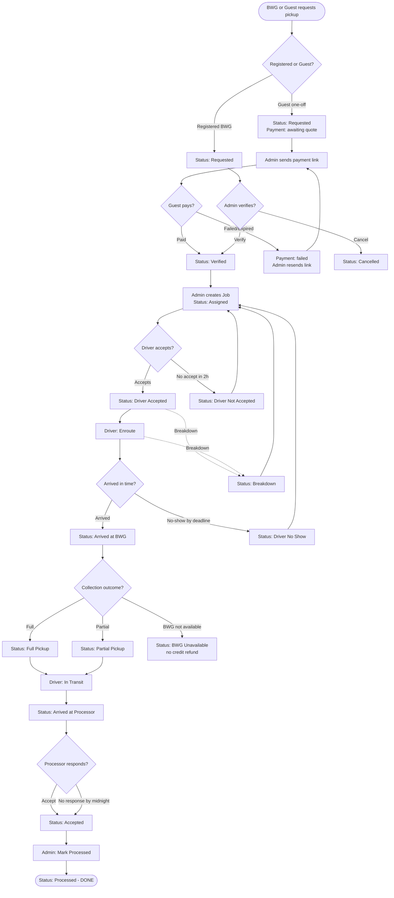
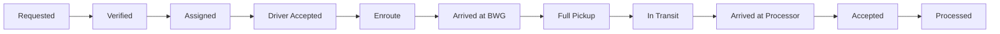
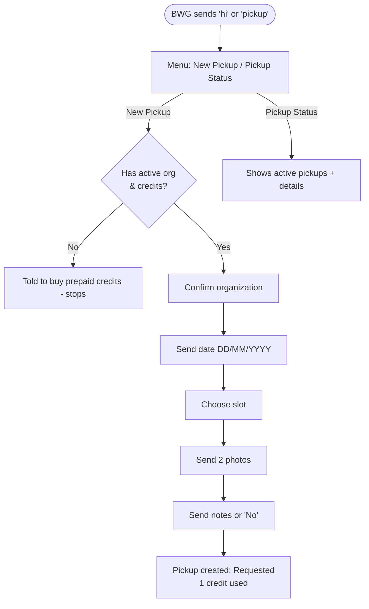
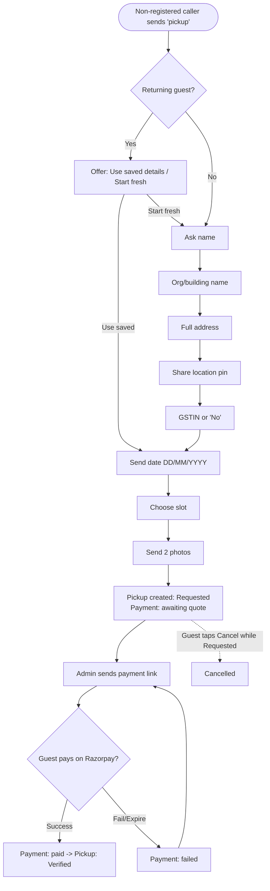
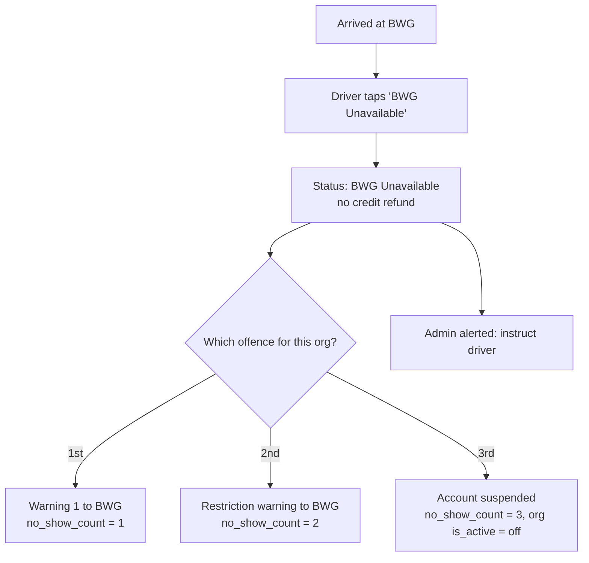

# GreensBrowns — Client Testing Manual (MVP)

This guide walks you, step by step, through testing every part of the
GreensBrowns platform. **No technical knowledge is needed.** Just follow each
scenario in order, do what it says, and check that the screen shows what we say
it should.

> **How to read this manual**
> - **Do this** = an action you perform (tap a button, send a WhatsApp message, click in the website).
> - **You should see** = what must appear on screen / on WhatsApp for the test to pass.
> - **Status badge** = the colored label shown against a pickup on the website. This is the main thing to verify.
> - **Page** = the website address (URL) where the action happens, e.g. `/dashboard/admin/pickups`.
> - **Wait** = some steps happen automatically on a timer (see the [Timers & automatic jobs](#9-timers--automatic-jobs-cron) table).

---

## Table of contents

1. [What you are testing](#1-what-you-are-testing)
2. [The people (roles) in the system](#2-the-people-roles-in-the-system)
3. [Before you start — setup checklist](#3-before-you-start--setup-checklist)
4. [The website pages at a glance](#4-the-website-pages-at-a-glance)
5. [Pickup status badges — what each one means](#5-pickup-status-badges--what-each-one-means)
6. [Master flow diagram (the whole journey)](#6-master-flow-diagram-the-whole-journey)
7. [Test scenarios (step by step)](#7-test-scenarios-step-by-step)
8. [WhatsApp message/button cheat-sheet](#8-whatsapp-messagebutton-cheat-sheet)
9. [Timers & automatic jobs (cron)](#9-timers--automatic-jobs-cron)
10. [Troubleshooting](#10-troubleshooting)

---

## 1. What you are testing

GreensBrowns connects four groups of people so that garden/leafy waste gets
collected from large generators and delivered to processors:

- **Bulk Waste Generators (BWGs)** — apartments, RWAs, tech parks — request pickups.
- **Collectors / Drivers** — drive vehicles to collect the waste.
- **Processors** — receive the waste (compost, biochar, mulch makers, farmers).
- **Admins** — run the platform: verify requests, build jobs, assign vehicles.

There are **two ways** a pickup can start:

1. **Registered BWG** — a signed-up organization with prepaid credits. Can request
   from the **website** or over **WhatsApp**.
2. **One-off guest** — a non-registered caller who requests a single pickup over
   **WhatsApp** and pays online via a Razorpay link.

---

## 2. The people (roles) in the system

| Role | What they do | How they mainly interact |
|------|--------------|--------------------------|
| **Admin** | Verifies pickups, creates jobs, assigns vehicles/drivers, sends payment links | Website |
| **BWG (Bulk Waste Generator)** | Requests pickups, buys prepaid credits | Website **and** WhatsApp |
| **Guest (one-off)** | Requests a single pickup, pays online | WhatsApp only |
| **Collector / Driver** | Accepts job, drives, marks progress | WhatsApp |
| **Processor** | Confirms receiving the waste | WhatsApp |

> For testing you will need **separate phone numbers** for the BWG, the driver,
> and the processor, because each receives different WhatsApp messages. The admin
> works on the website (a phone number is only needed if you want the admin to
> receive alert messages too).

---

## 3. Before you start — setup checklist

Tick each item before testing. Most of this is one-time.

### 3.1 Test user accounts (website)

Create these on the website (admin creates the others from `/dashboard/admin/users`
and related setup pages):

- [ ] **Admin** account (you log in with this).
- [ ] **BWG** account — register at `/register`, then complete the organization
      and service agreement (see Scenario 0).
- [ ] **Driver(s)** — added at `/dashboard/admin/setup/collector-vehicles` → **Drivers** tab.
- [ ] **Vehicle(s)** — added at `/dashboard/admin/setup/collector-vehicles` → **Vehicles** tab, and linked to a driver.
- [ ] **Processor(s)** — added at `/dashboard/admin/farmers`.

### 3.2 Phone numbers

- [ ] A phone number for the **BWG** (must match the number on the BWG profile).
- [ ] A phone number for each **Driver** (must match the driver record).
- [ ] A phone number for each **Processor**.
- [ ] (Optional) **Admin** phone number(s) on the admin profile(s) — needed to
      receive admin alert messages (no-show, breakdown, driver-not-accepted).

> **Important:** WhatsApp messages are matched by phone number. If the number on
> the website profile does not exactly match the WhatsApp number that messages
> in, the system will not recognize the user.

### 3.3 Meta WhatsApp (Business Suite)

- [ ] WhatsApp Business number connected (the number customers message).
- [ ] All message **templates** created and **approved** in WhatsApp Manager —
      see `docs`/`src/lib/whatsapp/META_TEMPLATES.md` for the exact list of **24
      templates** and their text. Testing of automatic notifications will fail
      for any template that is not approved.
- [ ] Webhook connected so the app receives incoming WhatsApp messages.

### 3.4 Razorpay (only for the one-off guest payment test)

- [ ] Razorpay account active (Test Mode is fine for testing).
- [ ] API keys set in the app environment: `RAZORPAY_KEY_ID`, `RAZORPAY_KEY_SECRET`.
- [ ] Webhook registered in Razorpay pointing to `https://<your-site>/api/webhooks/razorpay`
      with the secret saved as `RAZORPAY_WEBHOOK_SECRET`, subscribed to:
      `payment_link.paid`, `payment_link.cancelled`, `payment_link.expired`,
      `payment.failed`.
- [ ] Meta template **`bwg_payment_link`** approved (carries the payment link to the guest).

### 3.5 Prepaid credits (for registered BWG tests)

- [ ] Prepaid packages exist at `/dashboard/admin/setup/prepaid-packages`.
- [ ] The test BWG has at least one **approved** prepaid package with credits
      (admin approves purchases). A registered BWG cannot request a pickup with
      zero credits.

---

## 4. The website pages at a glance

| Page (URL) | Who | Purpose |
|------------|-----|---------|
| `/login` · `/register` | All | Sign in / sign up |
| `/dashboard/admin` | Admin | Overview |
| `/dashboard/admin/users` | Admin | Manage users |
| `/dashboard/admin/pickups` | Admin | **Main test page** — tabs: **Registered Pickups**, **One-Off Requests**, **Blocked Phones** |
| `/dashboard/admin/pickups/[id]` | Admin | One pickup's full detail & timeline |
| `/dashboard/admin/jobs` | Admin | Create jobs, assign vehicle/driver, reassign |
| `/dashboard/admin/organizations` | Admin | BWG orgs; suspend/activate |
| `/dashboard/admin/farmers` | Admin | Processors |
| `/dashboard/admin/reports` | Admin | Reports |
| `/dashboard/admin/setup/prepaid-packages` | Admin | Prepaid plans & purchase approvals |
| `/dashboard/admin/setup/pricing` | Admin | Pickup pricing |
| `/dashboard/admin/setup/collector-vehicles` | Admin | Tabs: **Vehicles**, **Drivers**, **Rates** |
| `/dashboard/bwg` | BWG | BWG home |
| `/dashboard/bwg/pickups` | BWG | List of their pickups |
| `/dashboard/bwg/pickups/new` | BWG | Request a new pickup |
| `/dashboard/bwg/organization` | BWG | Org details |
| `/dashboard/bwg/compliance` | BWG | Service agreement / documents |
| `/dashboard/bwg/prepaid` | BWG | Buy prepaid credits |
| `/dashboard/collector` · `/dashboard/collector/jobs` | Driver | Driver's jobs (driver mainly uses WhatsApp) |
| `/dashboard/farmer` · `/dashboard/farmer/deliveries` | Processor | Incoming deliveries |

---

## 5. Pickup status badges — what each one means

These are the colored labels you verify on `/dashboard/admin/pickups`. They are
the heartbeat of every test.

| Badge | Meaning |
|-------|---------|
| **Requested** | New request, waiting for admin to verify (or guest waiting to pay) |
| **Verified** | Admin (or successful payment) approved it; ready to be put in a job |
| **Assigned** | Put into a job; vehicle/driver assigned; collector notified |
| **Driver Accepted** | Driver accepted the job on WhatsApp |
| **Driver Not Accepted** | Driver did not accept in time → needs reassignment |
| **Driver No Show** | Driver accepted but never arrived by the deadline → needs reassignment |
| **Breakdown** | Driver reported a vehicle breakdown → needs reassignment |
| **Enroute** | Driver is on the way to the BWG |
| **Arrived at BWG** | Driver has reached the BWG |
| **Full Pickup** | All waste collected |
| **Partial Pickup** | Only part collected (rest needs a new pickup) |
| **In Transit** | Driving the waste to the processor |
| **Arrived at Processor** | Reached the processor |
| **Accepted** | Processor accepted the waste |
| **Rejected** | *(Not in use yet)* Reserved for a future "processor rejects waste" feature — processors cannot reject in the MVP |
| **Processed** | Final: waste processed |
| **BWG Unavailable** | BWG no-show; pickup closed, no credit refund |
| **Cancelled** | Cancelled (by BWG or admin) |

---

## 6. Master flow diagram (the whole journey)

---

## 7. Test scenarios (step by step)

Run these **in order**. Scenario 0 and the happy paths (1–3) first; the
exception paths (5–10) after.

---

### Scenario 0 — Set up a registered BWG (one-time)

**Goal:** create a BWG that can request pickups.

1. **Do this:** Go to `/register` and sign up as a BWG (name, phone, etc.). Use
   the BWG test phone number.
2. **Do this:** Log in as the BWG. Complete the **Organization** details at
   `/dashboard/bwg/organization` and sign the **service agreement** at
   `/dashboard/bwg/compliance`.
   - **You should see:** the organization marked active.
3. **Do this:** Buy a prepaid package at `/dashboard/bwg/prepaid`.
4. **Do this (Admin):** Approve the purchase at
   `/dashboard/admin/setup/prepaid-packages`.
   - **You should see:** the BWG's prepaid status become **Approved** with
     available credits.

> Without an active org **and** approved credits, a registered BWG cannot
> request a pickup.

---

### Scenario 1 — Registered BWG requests a pickup on the WEBSITE (happy path)

This is the full end-to-end lifecycle. Later exception scenarios branch off this.

**Flow:**

#### Step 1 — BWG creates the request
- **Do this (BWG):** Go to `/dashboard/bwg/pickups/new`. Pick a **date at least 2
  days away**, choose a slot (Morning/Afternoon/Evening), upload 2 waste photos,
  add notes, submit.
- **You should see:** a new pickup in `/dashboard/bwg/pickups`.
- **Status:** **Requested**.
- **WhatsApp:** the BWG receives the **pickup requested** message with a **Cancel** button.
- **Verify (Admin):** the pickup appears on `/dashboard/admin/pickups` → **Registered Pickups** tab as **Requested**.

#### Step 2 — Admin verifies
- **Do this (Admin):** On `/dashboard/admin/pickups`, open the pickup and tap
  **Verify** (enter estimated weight/volume).
- **Status changes to:** **Verified**.

#### Step 3 — Admin creates a job
- **Do this (Admin):** Go to `/dashboard/admin/jobs` → **Create Job** (or use
  **Suggest Jobs** on the pickups page). Select the verified pickup, a **vehicle**,
  a **driver**, and a **processor**, then create.
- **Status changes to:** **Assigned**.
- **WhatsApp (Driver):** receives **job assigned** with an **Accepted** button.
- **WhatsApp (BWG):** receives **pickup scheduled**.

#### Step 4 — Driver accepts
- **Do this (Driver):** On WhatsApp, tap **Accepted**.
- **Status changes to:** **Driver Accepted**.

#### Step 5 — Driver heads out and arrives
- **Do this (Driver):** Tap **Enroute** (on the job message or 1-hour reminder).
  - **Status:** **Enroute**.
- **Do this (Driver):** Tap **Arrived**.
  - **Status:** **Arrived at BWG**.
  - **WhatsApp (BWG):** receives **vehicle arrived**.

#### Step 6 — Driver collects (full)
- **Do this (Driver):** Tap **Full Pickup**.
  - **Status:** **Full Pickup**.
  - **WhatsApp (BWG):** **pickup collected**. **WhatsApp (Processor):** **delivery ETA**.
- **Do this (Driver):** Tap **In Transit**.
  - **Status:** **In Transit**.

#### Step 7 — Arrive at processor
- **Do this (Driver):** Tap **Arrived** (at processor).
  - **Status:** **Arrived at Processor**.
  - **WhatsApp (Processor):** **confirm delivery** with an **Accepted** button.
  - **WhatsApp (BWG):** **delivery confirmed**.

#### Step 8 — Processor accepts
- **Do this (Processor):** Tap **Accepted**.
  - **Status:** **Accepted**.
- **(Alternative — auto-accept):** if the processor does nothing, the system
  auto-accepts at **midnight IST** (see timers). Status becomes **Accepted**
  automatically.

#### Step 9 — Admin marks processed
- **Do this (Admin):** On `/dashboard/admin/pickups`, tap **Mark Processed**.
  - **Status:** **Processed**. ✅ Test complete.

---

### Scenario 2 — Registered BWG requests a pickup over WHATSAPP

Same lifecycle as Scenario 1, but the request is created in chat.

- **Do this (BWG):** Message **`hi`** (or `pickup`) to the WhatsApp number.
  - **You should see:** a greeting with buttons **New Pickup** and **Pickup Status**.
- **Do this:** Tap **New Pickup** → confirm organization → send a date (DD/MM/YYYY,
  at least 2 days out) → choose a slot → send 2 photos → send notes or `No`.
  - **Status (Admin page):** **Requested**, and **1 prepaid credit is consumed**.
  - **WhatsApp:** **pickup requested** confirmation with **Cancel** button.
- **Do this (BWG):** Message `hi` again → **Pickup Status**.
  - **You should see:** a list of active pickups; tapping one shows date, slot,
    status and assigned vehicle.
- **Continue:** from here the admin verifies and the flow is identical to
  Scenario 1, Steps 2–9.

> **Edge checks:** if the org is **suspended** or has **no credits**, the flow
> stops and tells the BWG to buy credits. If the BWG goes quiet for **1 hour**,
> the conversation expires — sending `hi` restarts at the menu.

---

### Scenario 3 — Guest one-off pickup over WhatsApp + Razorpay payment

#### Step 1 — Guest requests
- **Do this (Guest, a number NOT registered):** Message **`pickup`** to the
  WhatsApp number.
- **Do this:** Answer each question — name, organization/building, full address,
  **share the location** using WhatsApp's location button, GSTIN (or `No`), date
  (DD/MM/YYYY ≥ 2 days out), slot, then **2 waste photos**.
- **Status (Admin page → One-Off Requests tab):** **Requested**, payment
  **awaiting quote**.
- **WhatsApp:** **pickup requested** confirmation with a **Cancel** button.

#### Step 2 — Admin sends the payment link
- **Do this (Admin):** Go to `/dashboard/admin/pickups` → **One-Off Requests**
  tab → on the request tap **Send payment link**, enter the amount (₹), confirm.
- **Payment status changes to:** **quoted**.
- **WhatsApp (Guest):** receives the **payment link** message.

#### Step 3 — Guest pays
- **Do this (Guest):** Open the link, complete payment (use Razorpay **test**
  methods in Test Mode).
- **On success:** payment becomes **paid** and the **pickup status becomes
  Verified** automatically (via the payment webhook).
  - **Verify (Admin):** the One-Off request now shows payment **paid** and status
    **Verified**.
- **From here:** the admin creates a job and the flow continues exactly like
  Scenario 1, Steps 3–9.

#### Step 3b — Payment fails or expires (resend)
- **If payment fails/expires:** payment status becomes **failed**.
- **Do this (Admin):** tap **Resend link** (you may change the amount). The old
  link is cancelled and a new one is sent.
  - **Payment status:** back to **quoted**.

#### Step 3c — Guest cancels (only before payment is verified)
- **Do this (Guest):** while still **Requested**, tap **Cancel** on the pickup
  message.
  - **Status:** **Cancelled**.
- **After the admin has verified/payment is paid:** the Cancel button no longer
  works; the guest is told to contact support.

> **Returning guest:** if the same phone requests again later, the bot offers
> **Use saved details** (name, org, address, GSTIN, location) so they don't
> re-enter everything.

---

### Scenario 4 — Cancel a pickup

- **BWG (website):** open the pickup in `/dashboard/bwg/pickups` and cancel while
  it is **Requested**.
- **BWG (WhatsApp):** tap **Cancel** on the pickup requested message.
- **Admin (website):** on `/dashboard/admin/pickups`, tap **Cancel** on a
  **Requested** pickup.
- **Status:** **Cancelled**. **WhatsApp (BWG):** **pickup cancelled** message.
- **Credits:** for registered BWGs, prepaid credit is restored on cancellation.

---

### Scenario 5 — BWG no-show ("BWG Unavailable") + escalation

What happens when the driver arrives but the BWG isn't there.

- **Do this (Driver):** after **Arrived at BWG**, tap **BWG Unavailable**.
- **Status:** **BWG Unavailable** (pickup closed; **no credit refund**).
- **WhatsApp (BWG):** 1st time → warning 1; 2nd → restriction warning; 3rd →
  **account suspended**.
- **WhatsApp (Admin):** admin no-show alert with next-step instructions.
- **Verify (Admin):** on `/dashboard/admin/organizations`, the org's **no-show
  count** increases; on the **3rd**, status flips to **Suspended** (and the org
  can no longer request pickups or buy plans).
- **Recover:** admin can slide the org back to **Active** at
  `/dashboard/admin/organizations` (this resets the no-show count).

---

### Scenario 6 — Driver does not accept the job (reassignment)

- **Setup:** complete Scenario 1 up to **Assigned**, then **do nothing** as the driver.
- **Wait:** the driver-not-accepted check runs (see timers). The acceptance
  window is **120 minutes** from assignment.
- **Status changes to:** **Driver Not Accepted**.
- **WhatsApp (Admin):** alert to reassign.
- **Do this (Admin):** on `/dashboard/admin/jobs`, open the job → select a
  **different vehicle** → save to reassign.
- **Status:** back to **Assigned**; the new driver receives the job message.

---

### Scenario 7 — Driver no-show (accepted but never arrived)

- **Setup:** complete Scenario 1 up to **Driver Accepted** (or **Enroute**), then
  **do not** tap Arrived.
- **Wait:** the no-show check runs after the **slot deadline**:
  - Morning slot → **12:30 IST**, Afternoon → **16:30 IST**, Evening → **20:30 IST**.
- **Status changes to:** **Driver No Show**.
- **WhatsApp (Admin):** alert to arrange an alternate vehicle.
- **Verify (Admin):** on `/dashboard/admin/setup/collector-vehicles` → **Drivers**
  tab, the driver's **no-show count** increases.
- **Do this (Admin):** reassign the job (same as Scenario 6).

---

### Scenario 8 — Vehicle breakdown

- **Do this (Driver):** after accepting (status **Driver Accepted** or
  **Enroute**), tap **Breakdown**.
- **Status changes to:** **Breakdown**.
- **WhatsApp:** admin breakdown alert **and** BWG breakdown notice.
- **Do this (Admin):** reassign the job to another vehicle (same as Scenario 6).

> Note: **Breakdown** only works after the driver has accepted. If tapped from
> **Assigned**, the driver is asked to accept first.

---

### Scenario 9 — Partial pickup

- **Do this (Driver):** at **Arrived at BWG**, tap **Partial Pickup**.
- **Status:** **Partial Pickup**.
- **WhatsApp:** BWG partial notice, admin partial alert, processor delivery ETA.
- **Do this (Driver):** tap **In Transit** → continue to processor (Steps 7–9 of
  Scenario 1).
- **Remainder:** the leftover waste is **not** auto-created — the BWG or admin
  must raise a **new** pickup for it.

---

### Scenario 10 — Processor accept / auto-accept

> **Note:** In the MVP the processor **cannot reject** a pickup. They can only
> **Accept**. (The "Rejected" status exists in the system for a future release
> but is not used yet — do not test for it.)

- **Accept:** the processor taps **Accepted** on the delivery message → status
  becomes **Accepted**.
- **Auto-accept:** if the processor does not respond by **midnight IST**, the
  pickup is **auto-accepted** (**Accepted**) and the processor gets an
  auto-accepted message.

---

## 8. WhatsApp message/button cheat-sheet

**To start as a registered BWG:** send `hi`, `hello`, `pickup`, or `menu`.
**To start as a one-off guest:** send `pickup`, `new`, or `start`.

| Who | Button they tap | Resulting status |
|-----|-----------------|------------------|
| BWG / Guest | **Cancel** (on pickup requested) | Cancelled (only while Requested) |
| Driver | **Accepted** (on job assigned) | Driver Accepted |
| Driver | **Enroute** | Enroute |
| Driver | **Arrived** (at BWG) | Arrived at BWG |
| Driver | **Full Pickup** | Full Pickup |
| Driver | **Partial Pickup** | Partial Pickup |
| Driver | **BWG Unavailable** | BWG Unavailable |
| Driver | **In Transit** | In Transit |
| Driver | **Arrived** (at processor) | Arrived at Processor |
| Driver | **Breakdown** | Breakdown |
| Processor | **Accepted** | Accepted |

---

## 9. Timers & automatic jobs (cron)

Some steps happen automatically on a schedule. All times below are **IST**.
If you are testing and don't want to wait, ask the developer to **trigger the
job manually** (each is a URL under `/api/cron/...` protected by a secret).

| What it does | When it runs (IST) | What to expect |
|--------------|--------------------|----------------|
| **Collector reminders** | 1-hour reminders ~**5:00, 11:00, 15:00**; 24-hour reminders ~**6:00, 12:00, 16:00** | Driver gets reminder messages before the slot |
| **Driver-not-accepted check** | **13:00** daily (acceptance window is **120 min** from assignment) | Unaccepted **Assigned** pickups → **Driver Not Accepted** + admin alert |
| **Driver no-show check** | **12:30, 16:30, 20:30** (after each slot ends) | Accepted-but-not-arrived → **Driver No Show** + admin alert |
| **Processor auto-accept** | **00:00 (midnight)** | **Arrived at Processor** with no response → **Accepted** |
| **Daily job email** | **18:00** | Admins get an email listing **tomorrow's** jobs |
| **WhatsApp cleanup** | **Wednesday 00:00** | Old/expired chat sessions & orphan photos cleared (housekeeping) |

> **Hobby vs Pro hosting:** on the current plan some checks run **once a day** at
> the times above rather than continuously. So, for example, a "driver not
> accepted" may only flip at the next daily run. For instant testing, ask the
> developer to run the specific cron job on demand.

---

## 10. Troubleshooting

| Symptom | Likely cause | What to do |
|---------|--------------|------------|
| BWG/driver/processor gets **no WhatsApp message** | Phone number on the profile doesn't match the WhatsApp number, or the template isn't approved in Meta | Check the number on the website matches exactly; confirm the template is **Approved** in WhatsApp Manager |
| BWG **can't request a pickup** | Org not active, no approved prepaid credits, or org **suspended** | Approve credits at `/dashboard/admin/setup/prepaid-packages`; re-activate org at `/dashboard/admin/organizations` |
| WhatsApp bot **doesn't reply** to a guest | Didn't use a start keyword, or the number is blocked | Send `pickup`; check **Blocked Phones** tab on `/dashboard/admin/pickups` |
| Guest **didn't get the payment link** | `bwg_payment_link` template not approved, or 24h window closed | Approve the template; ensure the guest messaged recently |
| Payment succeeded but pickup **still Requested** | Razorpay webhook not configured/reachable | Verify the webhook URL & secret in Razorpay; check it's subscribed to `payment_link.paid` |
| Pickup **stuck** waiting on an automatic step | The cron job hasn't run yet | Wait for the scheduled time (Section 9) or ask the developer to trigger it |
| Date **rejected** when requesting | Date must be **at least 2 days** in the future | Pick a later date |

---

*Prepared for client UAT (User Acceptance Testing) of the GreensBrowns MVP. For
the exact WhatsApp template wording and technical mapping, see
`src/lib/whatsapp/META_TEMPLATES.md`.*
